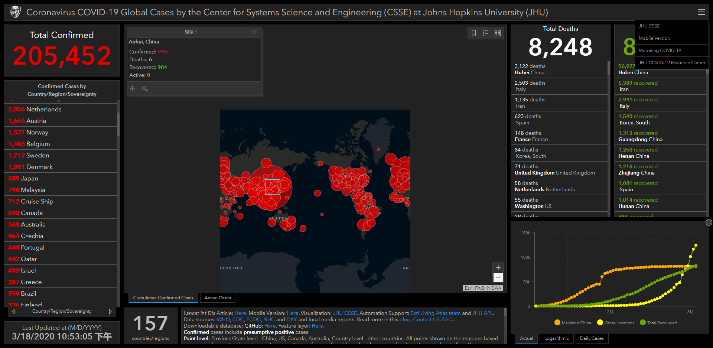

# ncov-2020

## 从新冠肺炎可视化说起，数据展示如何简约但不简单

1. 从新冠肺炎可视化说起，数据展示如何简约但不简单 : https://www.jiqizhixin.com/articles/2020-02-21

## 新型冠状病毒疫情实时动态省市地图

- GitHub： https://github.com/RunAtWorld/2019-ncov

## wuhan2020

1. wuhan2020 : https://github.com/wuhan2020

## ViralSpreading

一个基于java的模拟仿真程序

1. 仓库: https://gitee.com/RunAtWorld/viralspreading

### 2019新型冠状病毒疫情实时爬虫

- GitHub：https://github.com/RunAtWorld/DXY-COVID-19-Crawler

### ncovr: Read and process nCoV data 新型冠状病毒数据获取和可视化

- GitHub：https://github.com/RunAtWorld/ncovr

##  中国博士开发可交互全球疫情地图

- wechat： https://mp.weixin.qq.com/s/AQtvo-7TuLU5wmNPfN-QGg
- GitHub：https://github.com/CSSEGISandData/COVID-19

- 全球疫情地图: https://www.arcgis.com/apps/opsdashboard/index.html#/bda7594740fd40299423467b48e9ecf6

- 柳叶刀论文
  [An interactive web-based dashboard to track COVID-19 in real time](https://www.thelancet.com/journals/laninf/article/PIIS1473-3099(20)30120-1/fulltext)
  作者：Ensheng Dong, Hongru Du, Lauren Gardner

- 约翰霍普金斯 2019-nCoV 模型博客
  https://systems.jhu.edu/research/public-health/ncov-model/

